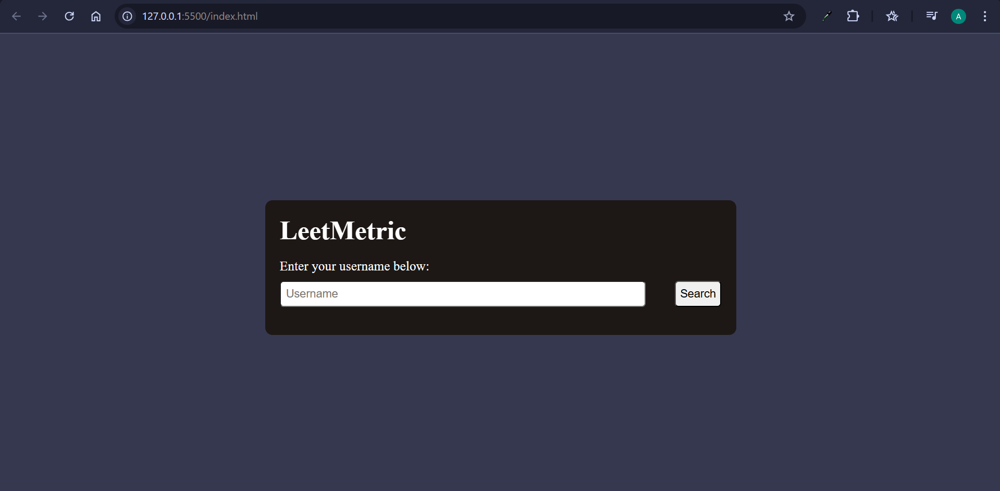
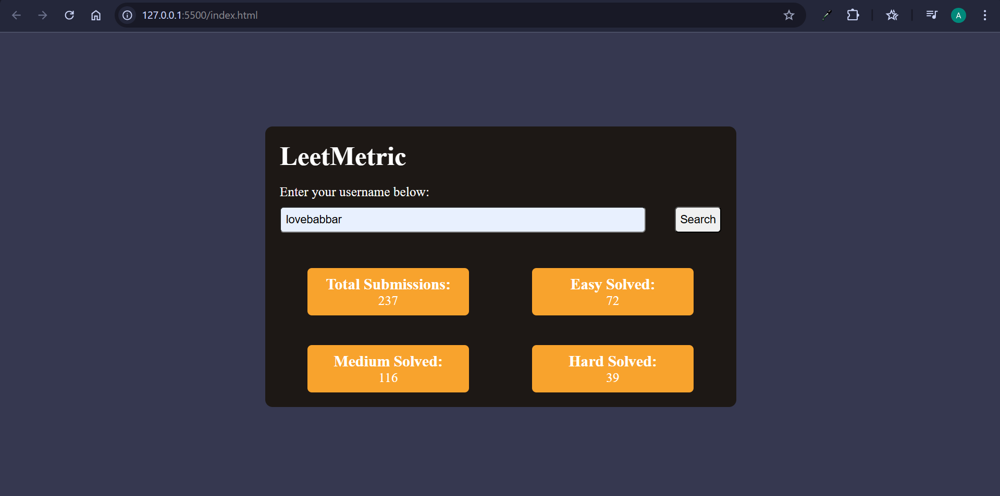
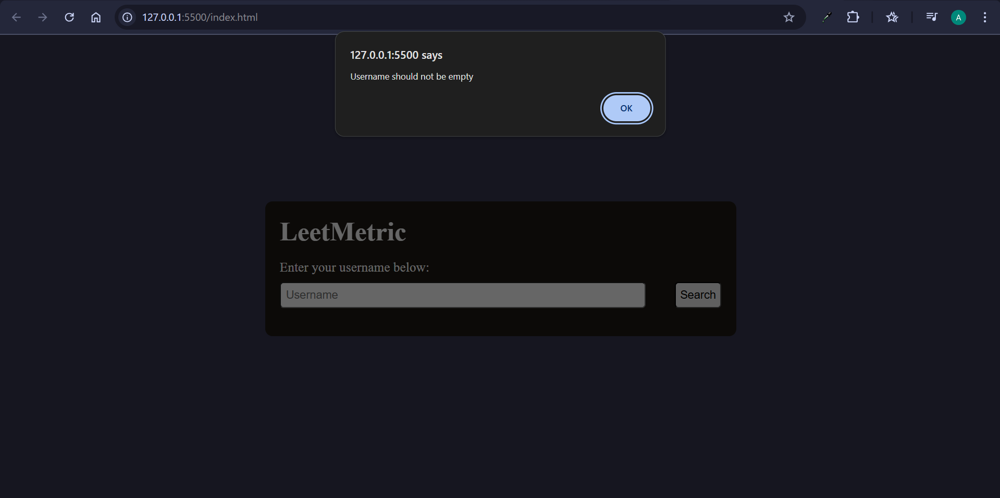
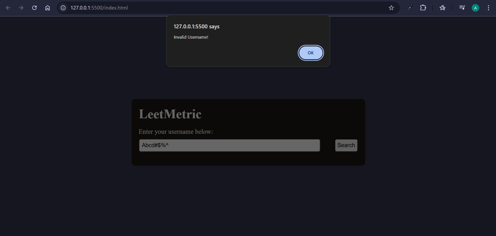
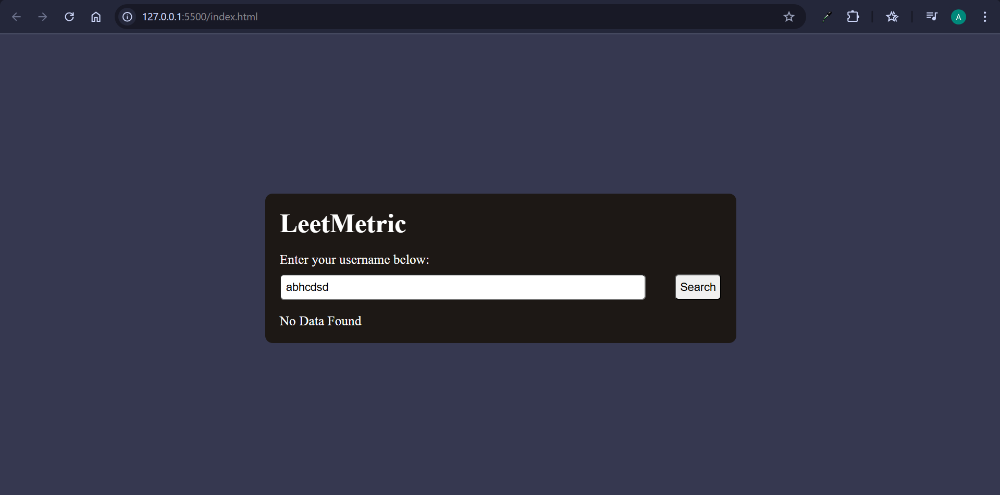

# LeetMetric 📊

A simple web application built using **HTML, CSS, and JavaScript** that allows users to check LeetCode statistics by entering a valid LeetCode username.

---

## Features

- Search any **LeetCode username**
- Displays:
  - Total problems submitted
  - Easy problems solved
  - Medium problems solved
  - Hard problems solved
- Clean and simple UI
- Beginner-friendly project (no framework, no backend)

---

## Tech Stack

- HTML
- CSS
- JavaScript

---

##  How It Works

1. Enter a valid LeetCode username.
2. Click on the **Search** button.
3. The app fetches public data from LeetCode.
4. User statistics are displayed on the screen.

---

## Notes

- This project uses **publicly available LeetCode data**.
- No user data is stored.
- Make sure the username is correct and publicly visible.

---

## Future Improvements

- Add loading animation
- Dark / Light mode
- Better error handling
- Mobile responsiveness
- Deploy the website

---

## Screenshots

### Landing Page

### Successful result found

### Empty Input validation

### Invalid Username format

### User not found

---

## Author

Made with ❤️ by **Abha**